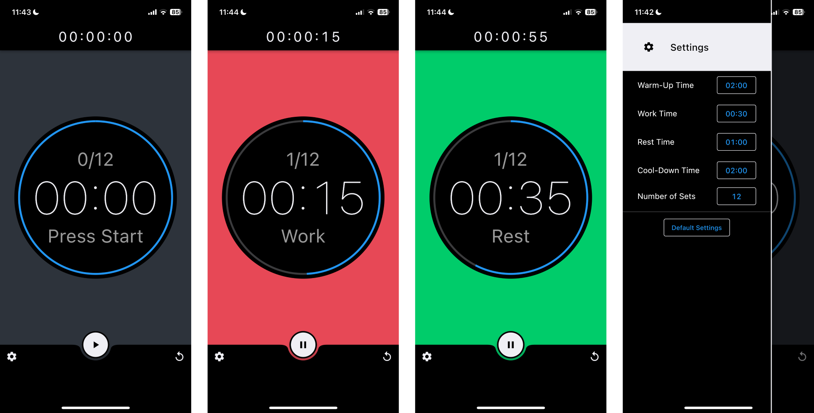

# HIIT Timer

A Dart/Flutter Timer for High-intensity interval training.

Allows customization of:

- Warm-Up Time
- Work Time
- Rest Time
- Cool-Down Time
- Number of Sets

Shows the time remaining per phase and total time.

## Screenshots

## Installation

To install as a PWA, visit https://mnxn.github.io/hiit/ and use your browser's
PWA installation method. For example, in Safari on iOS, open the share dialog
and click "Add to Home Screen".

The app is also built as a native iOS Application. However, it is not available
on the iOS App Store. One way to install it currently is to sideload the IPA
file with [AltStore](https://altstore.io/).
